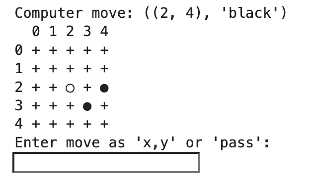

# AlphaGo Zero implementation
Currently not much documentation, as it mainly contains improvements on my groups work in https://github.com/tirsgaard/AlphaGo_Zero_implementation.

The training is executed in the main.py. The function containing the main algorithm is located in MCTS2.py

# Play
If you have a trained model, you can play against it in the 'play_against_newest_model.ipynb'. The interface looks like:

